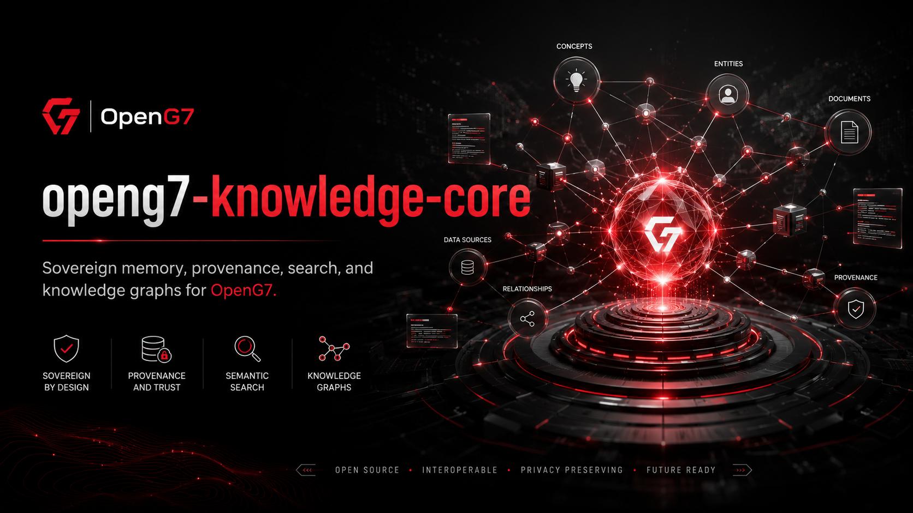

# OpenG7 Knowledge Core

Sovereign memory, provenance, semantic retrieval and knowledge graph foundation for the OpenG7 ecosystem.

> **Implementation status:** specification and governance only. Application workspaces,
> package manifests, Docker launch files and production checklists described below
> are planned, not present. Currently available validation:
> `node scripts/check-project-standards.mjs`. Read [AGENTS.md](AGENTS.md)
> and the [project architecture](docs/ARCHITECTURE.md) for the applicable scope.

## Workspace architecture

Target workspace architecture:

- `apps/knowledge-api`: authenticated HTTP API for ingestion, search, retrieval and provenance.
- `apps/knowledge-worker`: asynchronous ingestion, parsing, chunking, enrichment and re-indexing jobs.
- `packages/knowledge-domain`: immutable knowledge, source, relation and provenance models.
- `packages/knowledge-connectors`: controlled connectors for Git, files, APIs and OpenG7 services.
- `packages/knowledge-retrieval`: hybrid lexical, semantic and graph-aware retrieval logic.
- `packages/knowledge-policy`: access filters, jurisdiction constraints and release rules.
- `packages/knowledge-observability`: ingestion metrics, retrieval traces and diagnostic events.
- `packages/knowledge-sdk`: typed client used by OpenG7 applications and agents.

## Provenance-first approach

Every stored knowledge unit must remain connected to its origin.

At minimum, preserve:

- source identifier and source type
- repository, document or system of origin
- immutable content checksum
- ingestion and effective timestamps
- source version, commit or revision
- jurisdiction and data residency requirements
- visibility and access classification
- transformation history
- confidence and verification status

Do **not** return generated or transformed knowledge as authoritative when its original source cannot be identified.

## Retrieval guidance

Use hybrid retrieval rather than vector similarity alone:

- lexical search for exact identifiers, policy names and code symbols
- semantic search for conceptual similarity
- graph traversal for relationships and dependencies
- metadata filters for jurisdiction, organization, project and sensitivity
- recency and effective-date rules for time-sensitive knowledge
- reranking for task-specific relevance

Agents must receive compact evidence packages with citations and provenance, not unrestricted dumps of the knowledge store.

## Knowledge graph guidance

The graph should represent explicit, inspectable relationships such as:

- repository `DEPENDS_ON` package
- service `EXPOSES` API contract
- policy `APPLIES_TO` jurisdiction
- incident `AFFECTED` deployment
- pull request `RESOLVED` issue
- agent `USED` source
- document `SUPERSEDES` document

Avoid inferring permanent relationships from a single unverified model output.

## Reuse in other projects

OpenG7 services and agents should consume the shared SDK instead of coupling directly to storage engines:

- `@openg7/knowledge-domain`
- `@openg7/knowledge-sdk`
- `@openg7/knowledge-connectors`
- `@openg7/knowledge-retrieval`

Storage, embedding and graph providers remain replaceable behind internal ports.

## OpenG7 example configuration

A development configuration can start with:

- Organization: OpenG7
- Default locale: `fr-CA`
- Secondary locale: `en-CA`
- Default jurisdiction: `CA`
- Initial sources: OpenG7 Git repositories and architecture documents
- Retrieval mode: hybrid lexical + semantic
- External model access: disabled by default
- Provenance requirement: mandatory

## Commands

The initial workspace is expected to expose the following commands:

```bash
corepack enable
yarn install
yarn lint
yarn format
yarn format:check
yarn test
yarn build
yarn docs
```

Commands may evolve with the implementation, but CI should preserve equivalent lint, test, build, and documentation gates.

## Production launch

Use `docs/production-launch-checklist.md` for the first controlled deployment.

The initial production scope should be read-only retrieval over approved public or internal OpenG7 sources. Autonomous source mutation and cross-jurisdiction replication should remain disabled until policy enforcement and audit integration are validated.

## Knowledge Core module (V1)

### Environment variables

Set these variables for API, storage and ingestion processing:

- `KNOWLEDGE_PLATFORM_ENV` — `development`, `test`, or `production`.
- `KNOWLEDGE_ALLOWED_ORIGINS` — comma-separated browser origins allowed to call the API.
- `KNOWLEDGE_DATABASE_URL` — private PostgreSQL connection string for metadata and job state.
- `KNOWLEDGE_VECTOR_PROVIDER` — vector backend identifier, such as `pgvector` or another approved provider.
- `KNOWLEDGE_GRAPH_PROVIDER` — graph backend identifier; `postgres` is acceptable for the first version.
- `KNOWLEDGE_OBJECT_STORAGE_DRIVER` — `local` or an approved S3-compatible provider.
- `KNOWLEDGE_OBJECT_STORAGE_BUCKET` — private bucket for controlled source artifacts.
- `KNOWLEDGE_EMBEDDING_PROVIDER` — approved local embedding provider.
- `KNOWLEDGE_EMBEDDING_MODEL` — registered embedding model identifier.
- `KNOWLEDGE_DEFAULT_JURISDICTION` — default jurisdiction code applied when no narrower value exists.
- `KNOWLEDGE_INGESTION_BATCH_SIZE` — optional worker batch size.
- `KNOWLEDGE_MAX_SOURCE_BYTES` — maximum accepted source artifact size.
- `KNOWLEDGE_AUDIT_ENDPOINT` — optional OpenG7 audit event sink.
- `KNOWLEDGE_POLICY_ENGINE_URL` — optional URL for contextual access decisions.
- `KNOWLEDGE_IDENTITY_ISSUER` — trusted OpenG7 Identity issuer.

Example values should be maintained in `.env.example`. Secrets must never be returned through diagnostic endpoints.

### Local-first launch

The first development path may run with PostgreSQL and local object storage:

```bash
docker compose --profile database up -d postgres
corepack yarn dev
```

The local profile must not silently call external embedding or language-model APIs. External providers require explicit configuration and policy approval.

### Private PostgreSQL

PostgreSQL must remain private and should publish no host database port in production.

Recommended initial schemas:

- `knowledge_sources`
- `knowledge_source_versions`
- `knowledge_units`
- `knowledge_relations`
- `knowledge_embeddings`
- `knowledge_ingestion_jobs`
- `knowledge_access_events`

Versioned migrations belong in `apps/knowledge-api/migrations`.

### Ingestion API

Initial controlled endpoints:

```text
POST /api/knowledge/sources
GET  /api/knowledge/sources
GET  /api/knowledge/sources/:sourceId
POST /api/knowledge/sources/:sourceId/ingest
POST /api/knowledge/sources/:sourceId/reindex
GET  /api/knowledge/jobs/:jobId
```

Source creation and ingestion require authenticated service or administrator permissions.

### Retrieval API

```text
POST /api/knowledge/search
POST /api/knowledge/context
GET  /api/knowledge/units/:unitId
GET  /api/knowledge/units/:unitId/provenance
GET  /api/knowledge/graph/neighbours
```

`POST /api/knowledge/context` should return an evidence package containing:

- selected excerpts
- source and version references
- access classification
- confidence and freshness indicators
- graph relationships used
- retrieval trace identifier

### Repository ingestion

The Git connector should support:

- allowlisted repositories only
- branch and commit pinning
- incremental ingestion by commit
- binary and generated-file exclusions
- secret scanning before persistence
- symbol-aware code segmentation
- links between issues, pull requests, commits and files when available

The connector must never ingest repository secrets or unrestricted deployment credentials.

### Access control

Access decisions must combine:

- actor identity and organization
- source visibility
- jurisdiction
- data classification
- intended purpose
- requested operation
- model destination, when an AI model is involved

When `KNOWLEDGE_POLICY_ENGINE_URL` is configured, the API should obtain a decision before releasing protected context.

### Public read-only endpoint

A public deployment may expose only explicitly published knowledge:

```text
POST /api/public/knowledge/search
GET  /api/public/knowledge/units/:unitId
```

Private source metadata, internal notes, embeddings and access events must never be exposed publicly.

### Audit and observability

Record at minimum:

- actor and agent identity
- query purpose
- filters and policy decision
- sources returned
- model or application destination
- latency and retrieval quality signals
- denied access attempts

Raw prompts containing sensitive data should not be retained unless a policy explicitly permits it.

## Security principles

- deny access by default
- encrypt data in transit and at rest
- keep storage and databases private
- preserve immutable provenance
- require explicit provider allowlists
- isolate ingestion workers
- scan uploaded sources before processing
- minimize retained personal information
- support deletion, supersession and retention policies

## Integration with OpenG7

Primary integrations:

- `openg7-identity` — authenticates humans, organizations, services and agents.
- `openg7-ai-policy-engine` — authorizes release and use of protected knowledge.
- `openg7-agent-runtime` — requests evidence packages for agent tasks.
- `openg7-model-gateway` — supplies approved embedding or reranking models.
- `openg7-ai-evals` — evaluates retrieval quality, grounding and provenance.

## Initial roadmap

### V1

- Git and file ingestion
- provenance-preserving storage
- hybrid search
- typed context API
- repository-level access control
- audit events

### V2

- graph-aware retrieval
- document supersession rules
- multilingual retrieval
- jurisdiction-aware replication
- administrative review interface

### V3

- federated knowledge nodes
- verified knowledge publishing
- cross-organization trust policies
- privacy-preserving shared retrieval

## License and governance

OpenG7 Knowledge Core is intended to remain open, auditable and provider-neutral. The repository should use the OpenG7-approved open-source license and document all third-party data, model and connector licenses in `THIRD_PARTY_NOTICES.md`.
